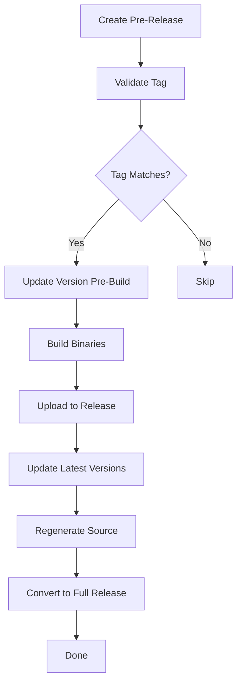

# PyKotor Release Workflows

Automated release workflows for all PyKotor tools.

## 📚 Documentation

1. **[RELEASE_WORKFLOW.md](RELEASE_WORKFLOW.md)** - Complete production workflow guide
   - How to create releases
   - What happens automatically
   - Troubleshooting

2. **[QUICK_TEST_GUIDE.md](QUICK_TEST_GUIDE.md)** - Safe testing guide
   - Test without affecting users
   - Verify workflow changes
   - Emergency rollback procedures

3. **[TESTING_RELEASES.md](TESTING_RELEASES.md)** - Detailed testing documentation
   - Test workflow architecture
   - Comparison with production
   - Advanced testing scenarios

## 🚀 Quick Start

### To Release (Production)

```bash
# On GitHub: Create pre-release with tag like v3.1.4-toolset
# Everything else is automatic!
```

### To Test (Safe)

```bash
# Create test release (never touches master)
git tag test-v3.1.99-toolset
git push origin test-v3.1.99-toolset
gh release create test-v3.1.99-toolset --prerelease --title "TEST" --notes "Testing"

# Cleanup
gh release delete test-v3.1.99-toolset --yes
git push origin --delete test-v3.1.99-toolset
```

## 📋 Production Workflows

| Workflow | Tag Pattern | Tool |
|----------|-------------|------|
| `release_toolset.yml` | `v*.*.*-toolset` | HolocronToolset |
| `release_kotordiff.yml` | `v*.*.*-kotordiff` | KotorDiff |
| `release_holopatcher.yml` | `v*.*.*-patcher` or `v*.*.*-holopatcher` | HoloPatcher |
| `release_guiconverter.yml` | `v*.*.*-guiconverter` | GuiConverter |
| `release_translator.yml` | `v*.*.*-translator` | Translator |

## 🧪 Test Workflows

| Workflow | Tag Pattern | Updates Branch |
|----------|-------------|----------------|
| `TEST_release_toolset.yml` | `test-v*.*.*-toolset` | `test-release` |

Generate more test workflows:

```powershell
.\create_test_workflow.ps1 -ToolName "kotordiff"
```

## 🔄 Two-Stage Update Process

### Stage 1: Pre-Build

- Updates `currentVersion`
- Commits to master (or test-release for tests)
- Ensures binaries have correct version

### Stage 2: Post-Upload

- Updates `toolsetLatestVersion`, `toolsetLatestBetaVersion`
- Commits to master (or test-release for tests)
- Regenerates release source archives
- Converts to full release (production only)

## ⚙️ Workflow Architecture



## 🛡️ Safety Features

- **Tag validation**: Only runs for matching tool patterns
- **Branch isolation**: Test workflows use separate branch
- **Pre-release default**: Stays pre-release if workflow fails
- **Manual override**: Can still edit/delete releases manually
- **Rollback support**: Can revert master commits if needed

## 📦 Artifacts

Each release includes:

**Windows**:

- `HolocronToolset_Windows_PyQt5_x86.zip`
- `HolocronToolset_Windows_PyQt5_x64.zip`

**Linux**:

- `HolocronToolset_Linux_PyQt5_x64.zip`

**macOS**:

- `HolocronToolset_macOS_PyQt5_x64.zip`

**Source**:

- Auto-generated by GitHub (tar.gz, zip)
- Regenerated after version updates

## 🐛 Troubleshooting

### Workflow doesn't trigger

- Ensure tag matches pattern exactly
- Check it's marked as pre-release
- View Actions tab for runs

### Build fails

- Check Actions logs for details
- Common: dependency issues, PyInstaller errors
- Fallback upload will attempt if primary fails

### Version not updating

- Verify file paths in workflow
- Check commit was made
- View Git history

### Need Help?

1. Check [RELEASE_WORKFLOW.md](RELEASE_WORKFLOW.md) for detailed production guide
2. Check [QUICK_TEST_GUIDE.md](QUICK_TEST_GUIDE.md) for safe testing
3. Check [TESTING_RELEASES.md](TESTING_RELEASES.md) for advanced testing
4. Check workflow logs in Actions tab
5. Open an issue on GitHub

## 🔧 Maintenance

### Updating Workflows

1. Make changes to production workflow
2. Test with TEST workflow first
3. If test passes, production is ready
4. Optional: Test on fork for final validation

### Adding New Tool

1. Copy existing workflow (e.g., `release_toolset.yml`)
2. Replace tool name and tag pattern
3. Update file paths and version fields
4. Create corresponding TEST workflow
5. Test thoroughly before first production use

## 📄 Files

- `release_*.yml` - Production release workflows
- `TEST_release_*.yml` - Test release workflows  
- `RELEASE_WORKFLOW.md` - Production workflow guide
- `TESTING_RELEASES.md` - Test workflow details
- `QUICK_TEST_GUIDE.md` - Quick testing guide
- `create_test_workflow.ps1` - Generate test workflows
- `README.md` - This file
