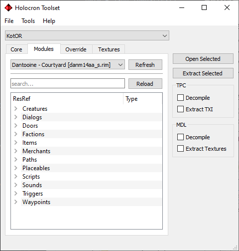

## Module Resources
Module resources refer to the resources stored in the game’s module files. These can be found in the “/modules/” directory of your game directory and behave like zip files (in the sense of storing multiple files into a single file), carrying the extensions ERF, MOD or RIM. Module resources can only be accessed by the specific module it is stored in.

Resources contained in the module files can be directly edited and saved through the toolset without having to extract them. However, this is an irreversible operation so if you are editing files shipped directly with the game be sure to make backups otherwise you will need to reinstall the whole game.

A single module can have its resources be stored across multiple module files and you can see this in the vanilla game (eg. danm14aa.rim and danm14aa_s.rim both contain resources for “Dantooine – Courtyard”). In the second game, the _dlg.erf would also be part of the module.

## Module Tab
The “Module” tab allows you to navigate through the various module files through a dropdown menu and view the resources stored inside them. Like the Core tab you can search for resources using the textbox.

The “Refresh” button will refresh the list of module files stored in the games folder.

The “Reload” button will reload the list of resources stored in the module file selected in the dropdown menu. If a resource is changed outside of the toolset, you will need to press this button or an error may occur.

