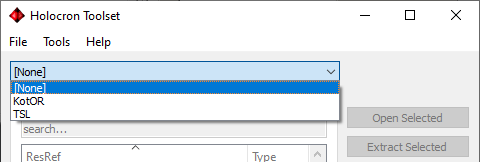
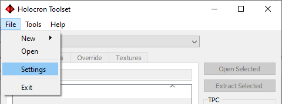
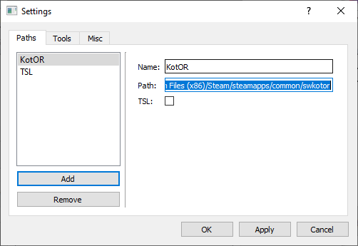
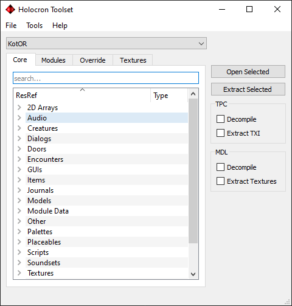

## What is Holocron Toolset?

Holocron Toolset is an application designed to edit the game files for the KotOR games. It comes with file editors specialized for nearly every file type used with the game. Packaged in the toolset is also a 3D module editor for editing existing maps plus a “Map Builder” tool which allows the user to create brand new layouts for maps using existing rooms.

## Configuration

Before you get started it is highly recommended configuring paths for the game directories. Although not entirely necessary, many of the file editors require it. There are two ways to configure the paths.

### Option 1

If you select a game from the dropdown menu without a path being set, you will be prompted to choose a folder. Pick the root folder for each game (containing the swkotor.exe/swkotor2.exe file).

### Option 2

Paths can be manually configured through the settings menu.

In a file explorer you will want to locate the root folder for each game (containing the swkotor.exe/swkotor2.exe file) and copy the path. Then select the respective game in the settings and paste the path to the directory.

##Selecting A Game

Once you have configured you game paths, when you select a game from the dropdown menu the application will load the game data and the disabled menus on the window will now become accessible:

You’re now ready to start modding!