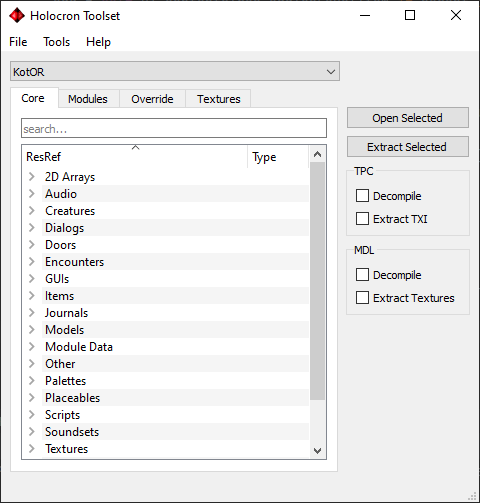

##Core Resources
Core resources refer to the resources stored in the games BIF files. They can be found in the “/data/” directory of your game folder. These resources are accessible from any module (map) in the game. Core resources can be opened and edited normally however you cannot overwrite the file stored in the BIF and need to store the file elsewhere such as your game’s override folder.

##Core Tab
The “Core” tab shows a list of all your resources. These resources are separated into different categories depending on their file type. You can also search for resources by filtering filenames with the textbox at the top.

