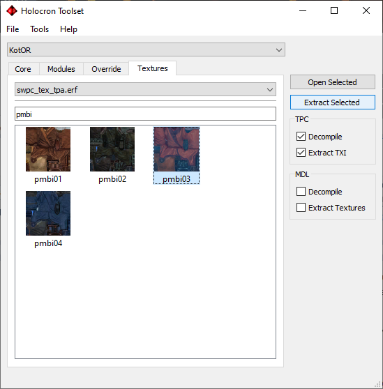
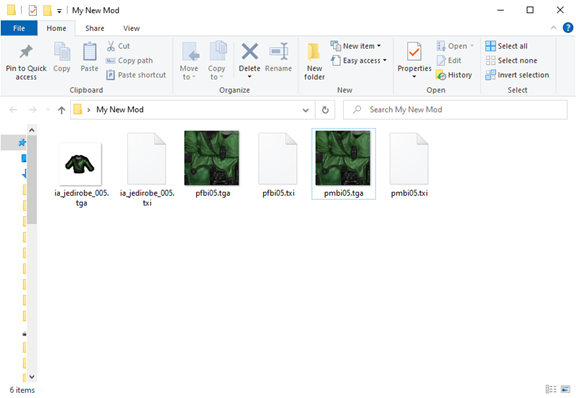
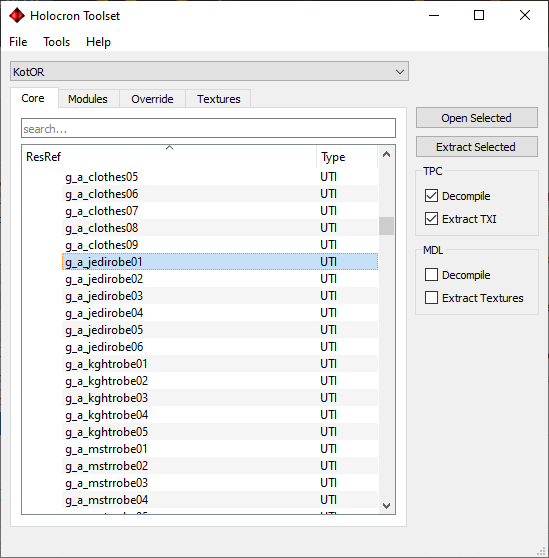
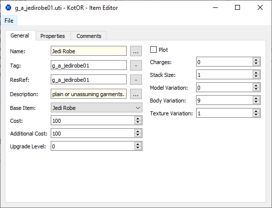
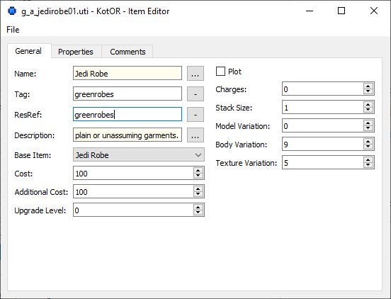
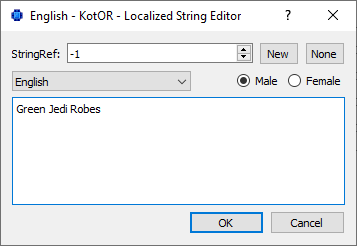
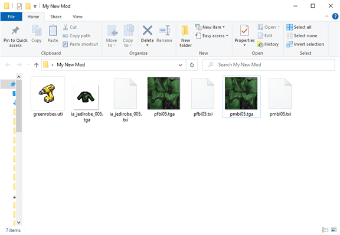
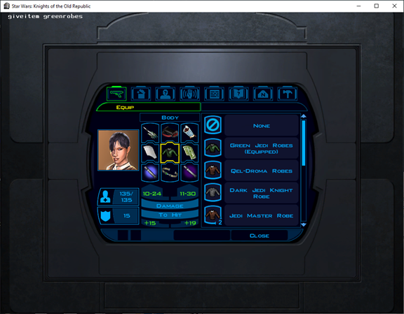
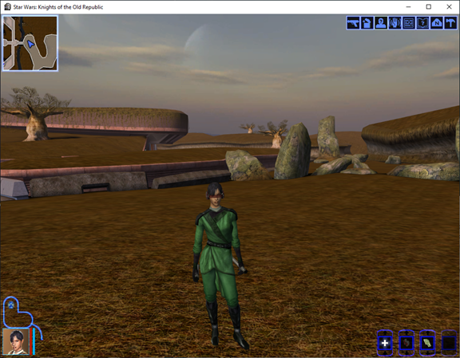

This tutorial will cover the basics of creating a new, custom-textured robe that you can add into the game. We will be using KotOR 1 for this demonstration, however the process is very much the same between both games.

First we will get started by reusing and editing existing resources.  We will extract the neccessary files into a folder for us to edit later.

First we need to get the textures for the player models. There two, one for the male model, one for the female model. We will use the existing red robes texture (pmbi03 and pfbi03). When extracting them from the textures tab be sure to tick "Decompile" and "Extract TXI options". It can be found under the "tpa" texturepacks in the dropdown menu.

We also need the icon (ia_jedirobe_003). It can be found in the "gui" option in the texturepack dropdown.

You should now have 6 files in total in your folder. What you want to do next is rename those files. Currently, there are four different textures for jedi robes, we will be making a fifth. So rename all the numbers from 03/003 to 05/005.

Then do your edits to the images. Make sure you are using an editor that supports transparency. MS Paint does not. If you are using Windows, I would recommend Paint.NET (its free). For this tutorial I will be retexturing the robes to a greenish colour.

Now that we have got the textures, we now need to create the actual item file. Under "Core" -> "Items", look for the file "g_a_jedirobe01" and open it.

There are a couple of fields we want to change here.

Change both the Tag and ResRef fields to something different. For example I will change mines to "greenrobes". Remember how we renamed the texture files? You will also want to change the Texture Variation to 5.

You may also want to change the name and/or description of your new item. Click the ellipsis (...) button next to the text field and it should open a new window. Click on the "None" button then change the text to whatever you desire.

Now save the file to the folder. The name should be the same as the text you put in the ResRef field (eg. "greenrobes"), this will also be used for the code of giving the item to using cheat codes.
You should have 7 files now.

Now copy all these files into your game's override folder and launch the game and load up a save file. Use the cheat code "giveitem greenrobes" and open up your inventory and equip it.

Creating a new custom-textured robe is as simple as that.

