This tutorial is intended to teach the user on how to create new area transitions that links two modules together.

For this tutorial we will:
- Create a new module using the Map Builder
- Create an area transition using a door from our new module to the Jedi Enclave
- Create an area transition using a trigger from the Jedi Enclave to our new module
- Create waypoints that the area transitions will link to

---

Let us begin with creating a simple module with the Map Builder. The map builder can be accessed through the main window via **File** -> **Indoor Map Builder**. You can view a list of controls through the Map Builder window via **Help** -> **Instructions**.

If you do not have any kits installed you will be prompted to download some. Otherwise, you can access the download window via **File** -> **Download Kits**. Download the **Enclave Surface** kit.

Create a simple layout like so:

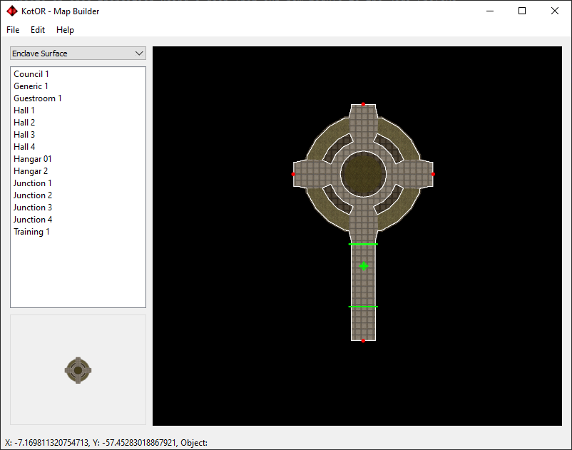

Go to the settings via **File** -> **Settings**. Change the values appropriately and make a note of the warp code as this is needed for the area transitions. The warp code used in this tutorial is _nthenc_.

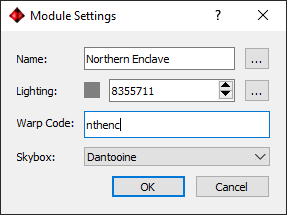

You can build the module via **File** -> **Build**. You should now be able to open up the game and warp to _nthenc_.

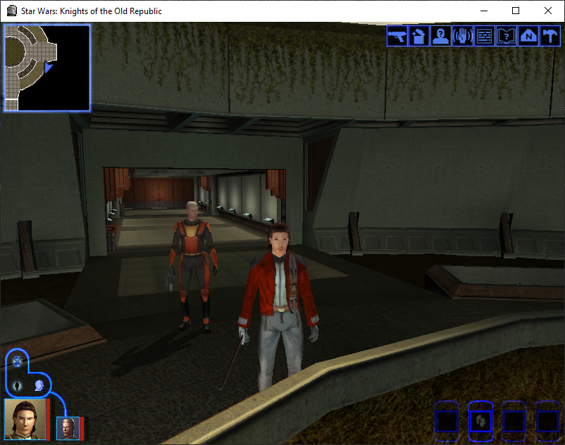

---

We will first configure the door in the module we created to warp us to the standard Jedi Enclave module.

In the main window, open the **Modules** tab and find your module. You will first need to click **Refresh** for it to appear in the list. Find the GIT file and open it.

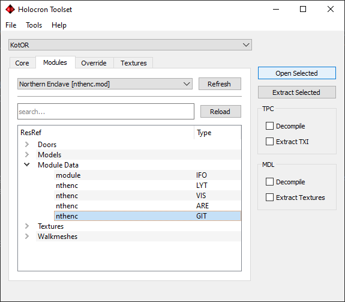

Select the door between the two hallway models. We are going to set it to warp the player to the other enclave module. Right-click and press **Edit Instance**.

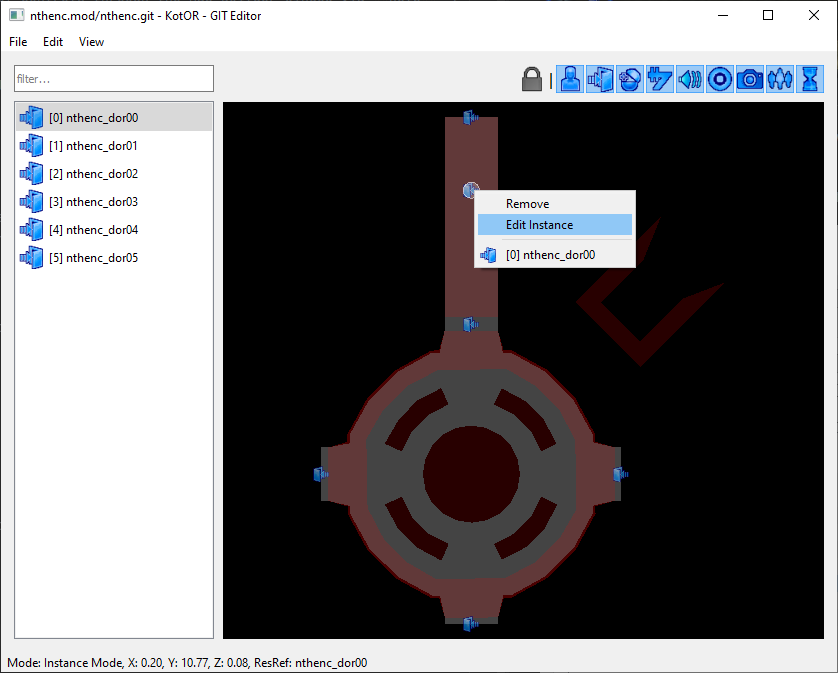

There are four values that need to be set:
- Select **Links To Waypoint**. This will set the transition to teleport the player to a waypoint after entering the new module.
- Edit **Link To Module**. This is the warp code for the module to transition to. The Jedi Enclave warp code is _danm13_.
- Edit **Link To Tag**. Since we specificed that the door links to a waypoint, this specifies that tag of the waypoint we will teleport to after warping. Make a note of this value; for this tutorial we will use the tag _from_nthenc_.
- Edit **Transition Name**. This is the text that appears when the player is facing an area transition. Normally it is the name of the location that the door will warp you to.

Select **OK** after you are finished editing.

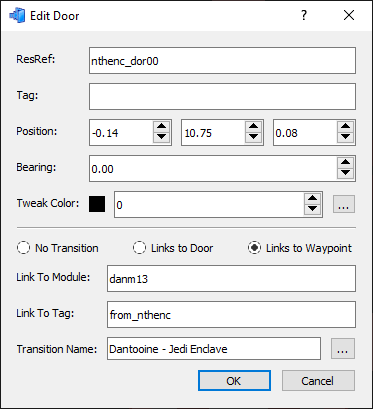

---

Next we will create a waypoint in the module we created. This waypoint is where our party teleports to after warping to this module from the Jedi Enclave.

Place the waypoint in front of the door on the side that leads to the rest of the module. You can create a waypoint by right-clicking then pressing **Insert Instance*. Right click it again and press **Edit Instance**.

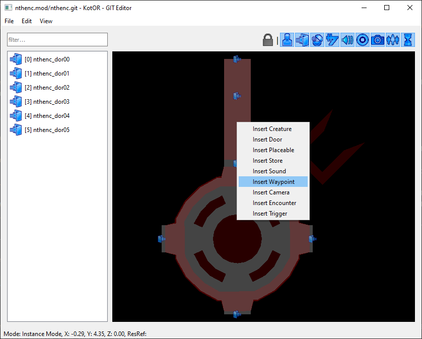

There are two values that need to be set:
- Edit **ResRef**. This is the filename for the waypoint resource we will create soon.
- Edit **Tag**. This is the tag which will be used to find the waypoint from the other module.

For simplicity, we will use the vale _from_danm13_ for both fields. Note that if you plan on having multiple links between the same modules then you will need to make sure that any waypoints you create have distinct values.

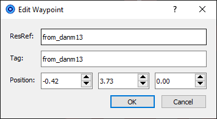

We will now create the waypoint file. Right-clicking the instance and pressing **Edit Resource** will create a new file in the override if it cannot find a file anywhere in your KotOR installation. Match the **ResRef** and **Tag** fields to the values that were assigned to the assignment.

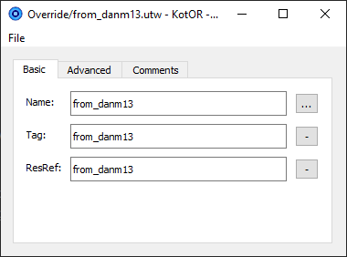

Remember to save your changes to the GIT file.

If you were to warp to the new module now, you will see that the area transition now works. However, we still need to configure a waypoint in the old enclave module otherwise our player will just warp to the spot infront of the Ebon Hawk.

---

We will now move to the original Jedi Enclave module.

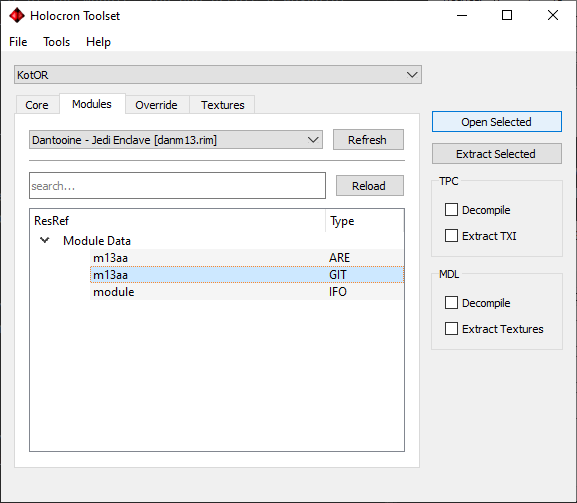

First we will create the trigger for warping the player to our new module. We will place this behind the Ebon Hawk. Right-click a spot near the door at the far right and press **Insert Trigger**.

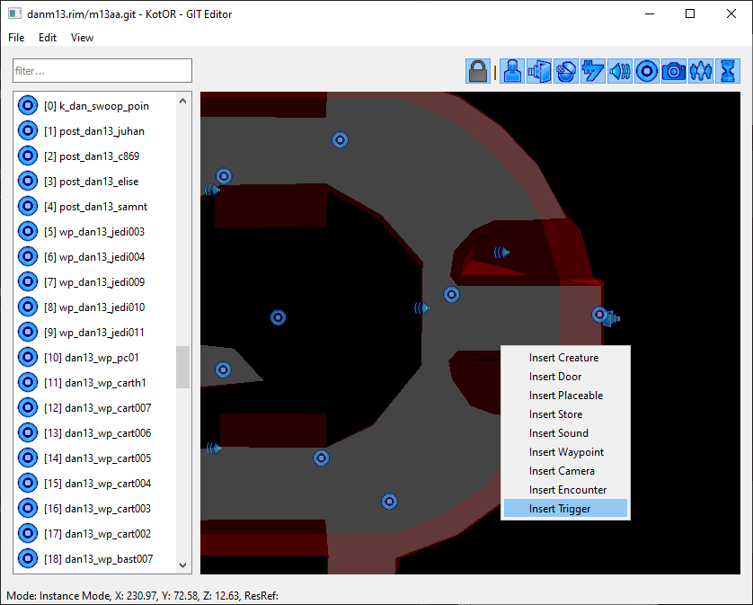

Right-click the new trigger and press **Edit Instance**.

There are now several values you will need to change:
- Edit **ResRef**. This is the filename for the trigger resource we will create soon. To keep things simple we will share the ResRef value with the Tag.
- Edit **Tag**. This is the tag that was referenced by our door in the **Link To Tag** field. The value that was assigned in this tutorial was _from_nthenc_.
- Select **Links To Waypoint**.
- Edit **Link To Module**. This is the warp code for the module to transition to. The warp code for the new module we created was _nthenc_.
- Edit **Link To Tag**. Since we specificed that the door links to a waypoint, this specifies that tag of the waypoint we will teleport to after warping. This value should be the Tag of the waypoint we created in our new module, which was _from_danm13_.
- Edit **Transition Name**. This is the text that appears when the player is facing an area transition. Normally it is the name of the location that the door will warp you to.

Press **OK** after you are finished editing.

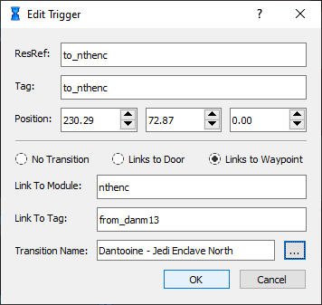

We will now create a file for our trigger. Select the trigger, right-click it and then press **Edit Resource**. Since this file does not exist it will create a new file in the override if it cannot find a file anywhere in your KotOR installation. Match the **ResRef** and **Tag** fields to the values that were assigned to the assignment.  Make sure to set the **Type** as _Transition_.

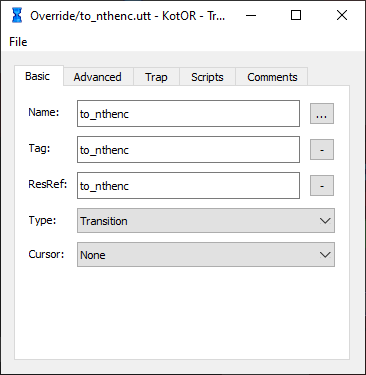

The trigger still needs some geometry that activates when the player enters it. Select the trigger and press **Edit Geometry**. You can now create vertices for your trigger by right-clicking again and pressing **Insert**.

Hold down the vertices to drag them around. Position them to cover the entire space in front of walkway to the door. Once you are done, right-click then press **Finish Editing**.

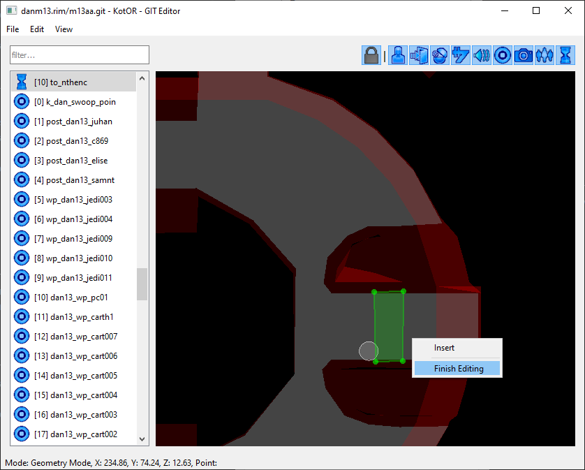

---

The last thing we need to do is add a final waypoint. This waypoint will be where the user will teleport to after warping from the new module. This will follow the same procedure as before. Right-click and press **Insert Waypoint**. Position it infront of the trigger on the side that is away from the door.

Now select it, right-click it and press **Edit Instance**. Set the Tag and the ResRef to _from_nthenc_, remembering that this is the same value as the **Link To Tag** field for the door in our new module.

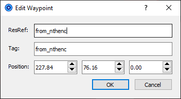

Right-click it again and press **Edit Resource**. Again, this will create the file in the override since it does not exist yet. Assign the same values that you used in the Edit Instance dialog. Save the file.

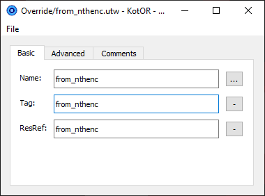

Finally, save the GIT file.

---

If you configured waypoints, door and trigger correctly, you should now be able to jump back and forth between the original Jedi Enclave module and our new module.

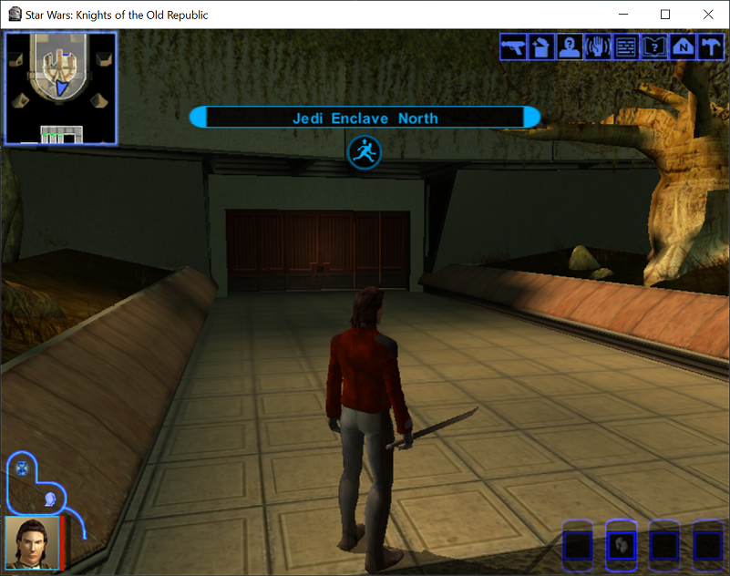

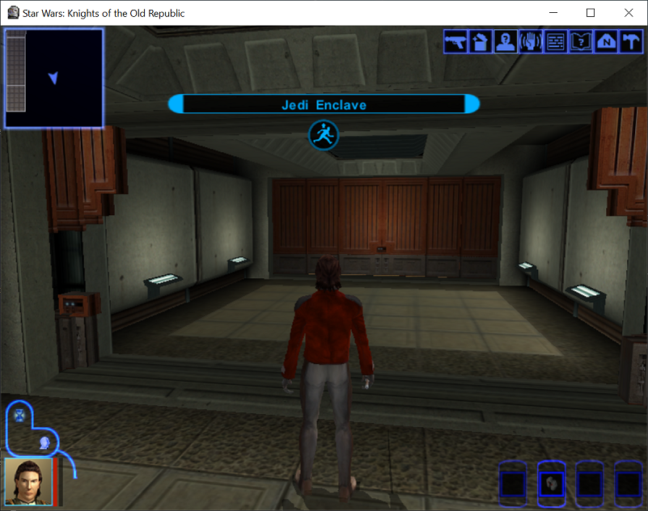
