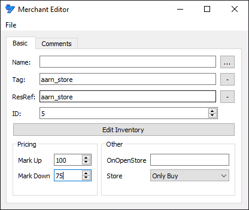
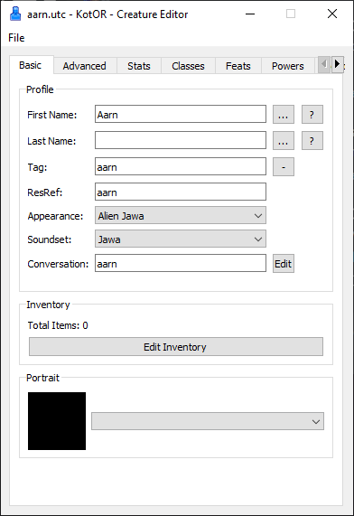
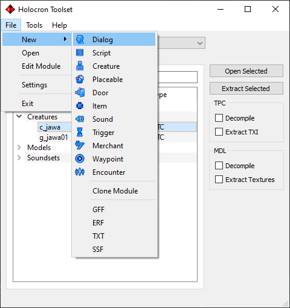
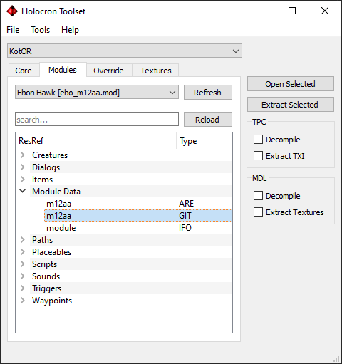
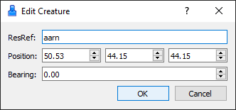

This tutorial’s primary goal is adding a new store in the game that the player can either buy or sell from. To achieve this, we will create a new NPC with some dialog that is used as an access point for our store and insert the NPC into the Ebon Hawk.

---

First we will create our merchant file.


The **Tag** and **ResRef** fields should match the name of our file which we will name _aarn_store_.

**Mark Up** and **Mark Down** influence the pricing of items in the store by a percentage, a **Mark Down** value of 50 for example will mean the player can sell the item for half its base price.



Clicking **Edit Inventory** will open a new window where you can drag items into the list of what is sold by the store. Also, if you right-click on an item in stock you can toggle whether the store has an infinite amount available.


After you are done you can then save the file. Remember that the filename should match the **ResRef** and **Tag**.

---

Now we need some way of accessing the store. What we will set up is adding a new NPC we can access their store via dialog. We will base our NPC off the **c_jawa** template that you can find in the **Core** tab.


There is a few thing we want to change from the template. Let's start by giving them a different name by pressing the ellipsis button, clicking None then typing in _aarn_.

We will also change the **Tag** and **ResRef** fields, which should mirror the filename just like the merchant file.

We also need to link a dialog file to the creature for when the player interacts with them. Set the value in the conversation field to _aarn_ for simplicity.



Save the file.

---

We now need a dialog file.



Let's keep this simple. We will have the NPC say hello and give the user a choice to browse Aarn's wares or leave. You can add new options by right-clicking a node and pressing **Add Reply**.

We will also need to link a script to the node that is meant to open the store. You can link the script by going to the **Scripts** tab then filling in the **ResRef** field for **Script #1**. Name the script _aarn_openstore_.

Now save the file. Remeber to name it the same value that we used in the conversation field in the UTC. So name it _aarn_.


---

Let us now create the script used to open the store. Explanation on how to script is out of the scope for the tutorial but the code required is quite simple:

```
void main()
{
	object oStore = GetObjectByTag("aarn_store");
	object oSpeaker = GetPCSpeaker();

	if (GetIsObjectValid(oStore))
    {
		DelayCommand(0.5, OpenStore(oStore, oSpeaker));
    }
}
```

The value given in the ```GetObjectByTag()``` function should match the tag that was assigned to the UTM file that was made earlier.

Save the file. Make sure that the filename matches what was entered in **Script #1** of your dialog file. The value this tutorial used was _aarn_openstore_. Go to the **File** menu and then press **Compile**.


---

We now have a NPC that triggers some dialog. That dialog can then be used to open the store. However, we still need to place the NPC somwhere. We will place the vendor on the Ebon Hawk for this tutorial.

In the Modules tab for the main window select module file **Ebon Hawk [ebo_m12aa.rim]**. Note that if you have a mod like K1CP you will need to select the module file that ends in .mod instead, as the files there have a higher priority. Open the GIT file (**m12aa**) that can be found under **Module Data**.



Lets add the vendor to the central room. You can do this by right-clicking where you want to place it. You will need to add both a **Creature** and a **Store**.


You will also need to link both the creature and the store to their respective files, _aarn_ and _aarn_store_. You can do this by selecting them by left-clicking them, then right-clicking them and pressing **Edit Instance**.




Save the GIT file. It will automatically save the changes into the .rim/.mod file, so you won't need to recompile the module file.

---

By now your override folder should look like this:


We can now test out our new store mod. Note that you will need to use a save from before the point you escaped Taris. This is because once you load a module for the first time it puts the GIT into your save file and the GIT inside the module file is no longer used again.

If you don't have a save file near the end of Taris you can just use the warp code _warp ebo_m12aa_ after creating a new game.


